<p align="center">
  
</p>

<!-- CUSTOM CSS-ANIMATED DEVELOPER DASHBOARD -->
<p align="center">
  
</p>

<p align="center">
  <a href="https://www.linkedin.com/in/charan-karthik-28ba89294/">
    
  </a>
  <a href="mailto:charankarthik26022@gmail.com">
    
  </a>
  <a href="https://github.com/Charankarthik26">
    
  </a>
</p>

---

## ⚡ The Developer Vibe (My Coding DNA)

```yaml
vibe:
  coffee_level: "████████░░ (80%) - Powered by Filter Coffee ☕"
  editor_tabs: "4 spaces (No exceptions) ⌨️"
  active_os: "Windows & Linux Subsystem (WSL) 🪟🐧"
  theme_vibe: "Tokyo Night / Cyberpunk Neon 🌌"
  curiosity: "Constant (Currently diving deep into WebSockets & AI Agents) 🧠"
```

---

## 👨‍💻 About Me

💡 **I am a passionate Full-Stack Software Engineer & Designer** dedicated to bridging the gap between robust, high-performance backends and clean, pixel-perfect user interfaces. I love building real-time applications, AI-integrated solutions, and civic tech that makes an impact.

```javascript
const charan = {
  pronouns: "He / Him",
  role: "Full-Stack Software Engineer & Designer",
  location: "Chennai, Tamil Nadu, India",
  philosophy: "Blending rigorous logical backend architectures with beautiful, pixel-perfect UIs.",
  currentFocus: {
    project: "Civic Issue Tracker (Real-time mapping & live alerts)",
    learning: ["Microservices", "System Design", "Advanced DevOps Pipelines"]
  },
  funFact: "Enjoys solving daily TypeScript puzzles and turning drawings/flowcharts into code."
};
```

---

## 🚀 My Dev Journey & Milestones

<table width="100%" border="0" cellpadding="8">
  <tr>
    <td width="20%" valign="top">📅 <strong>2025 - Present</strong></td>
    <td width="80%" valign="top">
      <strong>Full-Stack Engineer & AI Architect</strong> (Independent Projects)<br />
      Developing AI integrations (such as Snap2Code), optimizing backend APIs, and scaling real-time systems.
    </td>
  </tr>
  <tr>
    <td width="20%" valign="top">📅 <strong>2021 - 2025</strong></td>
    <td width="80%" valign="top">
      <strong>B.E. in Computer Science & Engineering</strong><br />
      Graduated with key expertise in systems engineering, databases, data structures, and computer networks.
    </td>
  </tr>
  <tr>
    <td width="20%" valign="top">📅 <strong>2023 - 2024</strong></td>
    <td width="80%" valign="top">
      <strong>Civic Tech Lead</strong> (Academic/Community Project)<br />
      Designed and launched the <em>Civic Issue Tracker</em>, implementing WebSocket communication and map integration for real-time local community alerts.
    </td>
  </tr>
</table>

---

## 🛠️ My Dev Ecosystem

### 💻 Frontend & Styling
<p align="left">
  <a href="https://skillicons.dev">
    
  </a>
</p>

### ⚙️ Backend & Frameworks
<p align="left">
  <a href="https://skillicons.dev">
    
  </a>
</p>

### 🗄️ Databases, DevOps & Tools
<p align="left">
  <a href="https://skillicons.dev">
    
  </a>
</p>

---

## 🌟 Featured Projects

<table border="0" width="100%">
  <tr>
    <td width="50%" valign="top">
      <blockquote>
        <h3>📸 Snap2Code</h3>
        <p>An AI-powered tool combining OCR, image captioning, and code generation APIs to convert snapshots of UI flowcharts/sketches into clean, responsive HTML/JS/CSS code.</p>
        <p>
          <a href="https://github.com/Charankarthik26/Snap2Code"></a>
          
          
        </p>
      </blockquote>
    </td>
    <td width="50%" valign="top">
      <blockquote>
        <h3>🏛️ Civic Issue Tracker</h3>
        <p>A full-stack, real-time application allowing citizens to report community issues via interactive maps, featuring sub-second updates using WebSockets and admin dashboards.</p>
        <p>
          <a href="https://github.com/Charankarthik26/Civic-Issue-Tracker"></a>
          
          
        </p>
      </blockquote>
    </td>
  </tr>
  <tr>
    <td width="50%" valign="top">
      <blockquote>
        <h3>🏨 Room Reservation Engine</h3>
        <p>High-reliability booking portal built in PHP & Python utilizing smart conflict-detection rules and interactive slot assignment maps.</p>
        <p>
          <a href="https://github.com/Charankarthik26/Room-Reservation-Engine"></a>
          
          
        </p>
      </blockquote>
    </td>
    <td width="50%" valign="top">
      <blockquote>
        <h3>🧩 Daily TypeScript Puzzles</h3>
        <p>Daily TypeScript algorithmic challenge repository testing code coverage, clean patterns, and performant data structures.</p>
        <p>
          <a href="https://github.com/Charankarthik26/Daily-Puzzle"></a>
          
        </p>
      </blockquote>
    </td>
  </tr>
</table>

---

## 📈 GitHub Stats & Activity

<!-- CONTRIBUTION SNAKE ANIMATION -->
<p align="center">
  <picture>
    <source media="(prefers-color-scheme: dark)" srcset="https://raw.githubusercontent.com/Charankarthik26/Charankarthik26/output/github-contribution-grid-snake-dark.svg" />
    <source media="(prefers-color-scheme: light)" srcset="https://raw.githubusercontent.com/Charankarthik26/Charankarthik26/output/github-contribution-grid-snake.svg" />
    
  </picture>
</p>

<p align="center">
  
</p>

<table border="0" width="100%">
  <tr>
    <td width="50%" align="center" valign="top">
      
    </td>
    <td width="50%" align="center" valign="top">
      
    </td>
  </tr>
</table>

<p align="center">
  
</p>

---

<p align="center">
  Designing and building interfaces with 💖. Let's build something awesome together!
</p>
